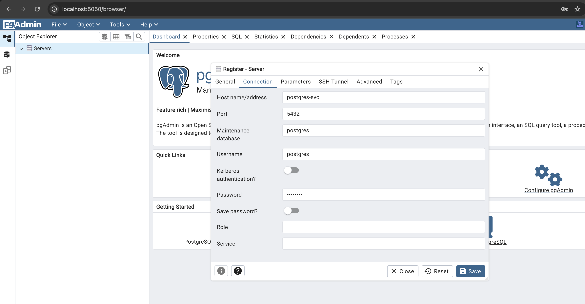
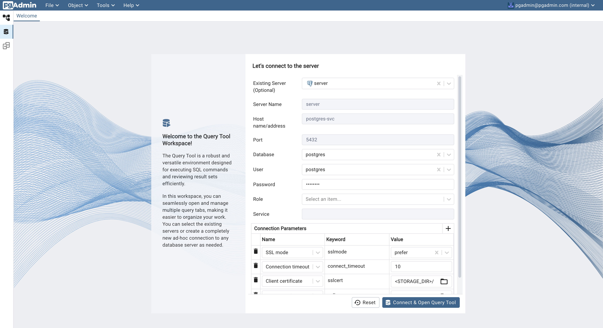
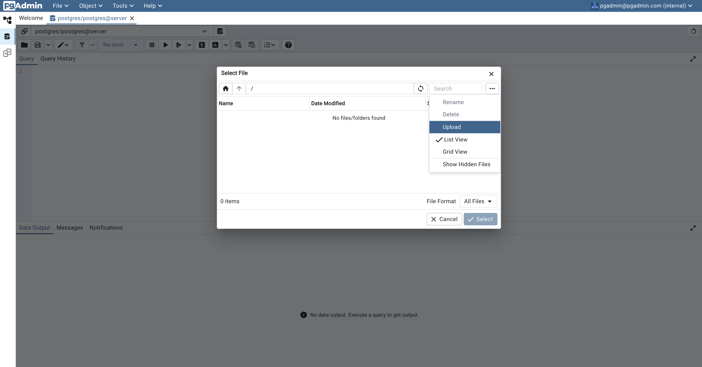
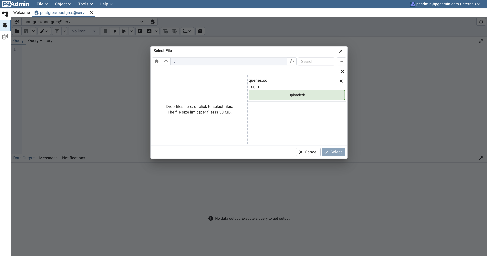
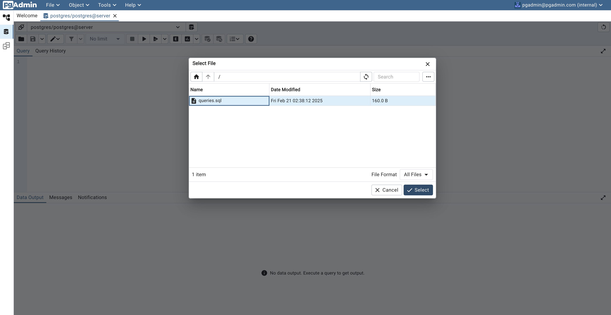
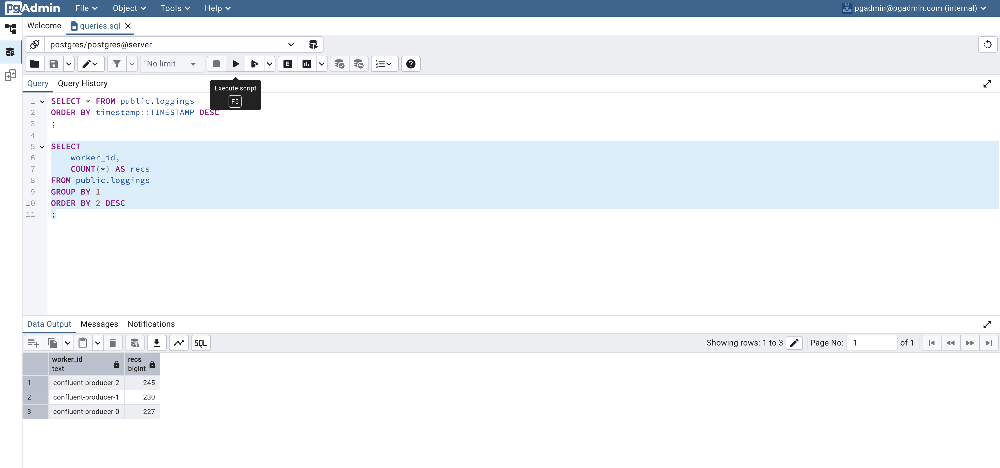

# Python + Kafka + PostgreSQL + Spark (Kubeflow) + Kubernetes (KinD)

## Architecture

[--- Python ---] --> [--- Kafka ---] --> [--- PostgreSQL ---] --> [--- Spark ---]

[-------------------------------- Kubernetes ---------------------------------]

## Prerequisites

- [Docker](https://docs.docker.com/engine/install/)
- [Kind](https://kind.sigs.k8s.io/docs/user/quick-start/#installation)

## Walkthrough

1. Start up: `./scripts/start`

    ```zsh
    Creating cluster "kind" ...
    ✓ Ensuring node image (kindest/node:v1.32.2) 🖼
    ✓ Preparing nodes 📦 📦 📦 📦  
    ✓ Writing configuration 📜 
    ✓ Starting control-plane 🕹️ 
    ✓ Installing CNI 🔌 
    ✓ Installing StorageClass 💾 
    ✓ Joining worker nodes 🚜 
    Set kubectl context to "kind-kind"
    You can now use your cluster with:

    kubectl cluster-info --context kind-kind

    Not sure what to do next? 😅  Check out https://kind.sigs.k8s.io/docs/user/quick-start/
    namespace/kafka created
    Context "kind-kind" modified.
    statefulset.apps/kafka created
    service/kafka-svc created
    deployment.apps/registry-schema created
    service/registry-schema created
    Awaiting kafka...
    Awaiting kafka...
    Awaiting kafka...
    Awaiting kafka...
    Awaiting kafka...
    Awaiting kafka...
    Awaiting kafka...
    kafka ready!
    registry-schema ready!
    [+] Building 0.8s (10/10) FINISHED                                                                                                                                                                                                                   docker:desktop-linux
    => [internal] load build definition from Dockerfile                                                                                                                                                                                                                 0.0s
    => => transferring dockerfile: 255B                                                                                                                                                                                                                                 0.0s
    => [internal] load metadata for docker.io/library/python:3.9-slim                                                                                                                                                                                                   0.7s
    => [auth] library/python:pull token for registry-1.docker.io                                                                                                                                                                                                        0.0s
    => [internal] load .dockerignore                                                                                                                                                                                                                                    0.0s
    => => transferring context: 2B                                                                                                                                                                                                                                      0.0s
    => [1/4] FROM docker.io/library/python:3.9-slim@sha256:d1fd807555208707ec95b284afd10048d0737e84b5f2d6fdcbed2922b9284b56                                                                                                                                             0.0s
    => => resolve docker.io/library/python:3.9-slim@sha256:d1fd807555208707ec95b284afd10048d0737e84b5f2d6fdcbed2922b9284b56                                                                                                                                             0.0s
    => [internal] load build context                                                                                                                                                                                                                                    0.0s
    => => transferring context: 2.49kB                                                                                                                                                                                                                                  0.0s
    => CACHED [2/4] WORKDIR /app                                                                                                                                                                                                                                        0.0s
    => CACHED [3/4] COPY producer/producer.py .                                                                                                                                                                                                                         0.0s
    => CACHED [4/4] RUN pip install --upgrade pip &&     pip install confluent-kafka[json,schemaregistry]                                                                                                                                                               0.0s
    => exporting to image                                                                                                                                                                                                                                               0.0s
    => => exporting layers                                                                                                                                                                                                                                              0.0s
    => => exporting manifest sha256:0baa47c2ff8c58fad1196f3cf74f2473097967e0030af92f681ec211627712aa                                                                                                                                                                    0.0s
    => => exporting config sha256:593d7eb1e22effbe800665959f90971e395d9e1e753b0ab149dbf893b549a1ff                                                                                                                                                                      0.0s
    => => exporting attestation manifest sha256:dbd119369d7646754dcb55fa983a9db9c9b49eabd3e58f1d9f2ab3e7f9ea7106                                                                                                                                                        0.0s
    => => exporting manifest list sha256:92369970a56f2f2c3107a62be5b5dc7c960342fb9babdf7b2538f44c7d94b462                                                                                                                                                               0.0s
    => => naming to docker.io/library/confluent-producer:1.0.0                                                                                                                                                                                                          0.0s
    => => unpacking to docker.io/library/confluent-producer:1.0.0                                                                                                                                                                                                       0.0s

    View build details: docker-desktop://dashboard/build/desktop-linux/desktop-linux/kumx5apjnkd5699xwuzliihxq

    What's next:
        View a summary of image vulnerabilities and recommendations → docker scout quickview 
    Image: "confluent-producer:1.0.0" with ID "sha256:92369970a56f2f2c3107a62be5b5dc7c960342fb9babdf7b2538f44c7d94b462" not yet present on node "kind-control-plane", loading...
    Image: "confluent-producer:1.0.0" with ID "sha256:92369970a56f2f2c3107a62be5b5dc7c960342fb9babdf7b2538f44c7d94b462" not yet present on node "kind-worker", loading...
    Image: "confluent-producer:1.0.0" with ID "sha256:92369970a56f2f2c3107a62be5b5dc7c960342fb9babdf7b2538f44c7d94b462" not yet present on node "kind-worker3", loading...
    Image: "confluent-producer:1.0.0" with ID "sha256:92369970a56f2f2c3107a62be5b5dc7c960342fb9babdf7b2538f44c7d94b462" not yet present on node "kind-worker2", loading...
    [+] Building 0.7s (8/8) FINISHED                                                                                                                                                                                                                     docker:desktop-linux
    => [internal] load build definition from Dockerfile                                                                                                                                                                                                                 0.0s
    => => transferring dockerfile: 321B                                                                                                                                                                                                                                 0.0s
    => [internal] load metadata for docker.io/confluentinc/cp-kafka-connect:7.6.0                                                                                                                                                                                       0.6s
    => [auth] confluentinc/cp-kafka-connect:pull token for registry-1.docker.io                                                                                                                                                                                         0.0s
    => [internal] load .dockerignore                                                                                                                                                                                                                                    0.0s
    => => transferring context: 2B                                                                                                                                                                                                                                      0.0s
    => [1/3] FROM docker.io/confluentinc/cp-kafka-connect:7.6.0@sha256:8e904b33d2693e3e251023b3d09448e30f49b38b1f1cd882883c30323a25585d                                                                                                                                 0.0s
    => => resolve docker.io/confluentinc/cp-kafka-connect:7.6.0@sha256:8e904b33d2693e3e251023b3d09448e30f49b38b1f1cd882883c30323a25585d                                                                                                                                 0.0s
    => CACHED [2/3] RUN curl -L -o /usr/share/java/kafka/postgresql.jar   https://jdbc.postgresql.org/download/postgresql-42.7.3.jar                                                                                                                                    0.0s
    => CACHED [3/3] RUN confluent-hub install --no-prompt confluentinc/kafka-connect-jdbc:10.7.3                                                                                                                                                                        0.0s
    => exporting to image                                                                                                                                                                                                                                               0.1s
    => => exporting layers                                                                                                                                                                                                                                              0.0s
    => => exporting manifest sha256:84fb90a2fbd4052d536c4c27394ae4f93c7c00bff753e25929534933a151dee0                                                                                                                                                                    0.0s
    => => exporting config sha256:75367a9a5ff4bd4e3b79407f6eba20c74067f9b86c90ea50dd428da32948115b                                                                                                                                                                      0.0s
    => => exporting attestation manifest sha256:1056da76b12382bb25346edc9f4390b5bceb2f71025667c80f7317fab0151d84                                                                                                                                                        0.0s
    => => exporting manifest list sha256:11165693b78c56a20509ace14df3fedd494009bd2f9a351b4b53656675d55b6c                                                                                                                                                               0.0s
    => => naming to docker.io/library/kafka-connect-postgres:1.0.0                                                                                                                                                                                                      0.0s
    => => unpacking to docker.io/library/kafka-connect-postgres:1.0.0                                                                                                                                                                                                   0.0s

    View build details: docker-desktop://dashboard/build/desktop-linux/desktop-linux/uez3ltsjbxxd92saocu97heqq

    What's next:
        View a summary of image vulnerabilities and recommendations → docker scout quickview 
    Image: "kafka-connect-postgres:1.0.0" with ID "sha256:11165693b78c56a20509ace14df3fedd494009bd2f9a351b4b53656675d55b6c" not yet present on node "kind-control-plane", loading...
    Image: "kafka-connect-postgres:1.0.0" with ID "sha256:11165693b78c56a20509ace14df3fedd494009bd2f9a351b4b53656675d55b6c" not yet present on node "kind-worker", loading...
    Image: "kafka-connect-postgres:1.0.0" with ID "sha256:11165693b78c56a20509ace14df3fedd494009bd2f9a351b4b53656675d55b6c" not yet present on node "kind-worker3", loading...
    Image: "kafka-connect-postgres:1.0.0" with ID "sha256:11165693b78c56a20509ace14df3fedd494009bd2f9a351b4b53656675d55b6c" not yet present on node "kind-worker2", loading...
    deployment.apps/kafka-connect created
    service/kafka-connect created
    statefulset.apps/postgres created
    service/postgres-svc created
    deployment.apps/pgadmin created
    service/pgadmin created
    Awaiting kafka-connect...
    kafka-connect ready!
    Awaiting postgres...
    postgres ready!
    pgadmin ready!
    {"name":"postgres-sink-connector","config":{"connector.class":"io.confluent.connect.jdbc.JdbcSinkConnector","tasks.max":"1","topics":"loggings","connection.url":"jdbc:postgresql://postgres-svc:5432/postgres","connection.user":"postgres","connection.password":"postgres","auto.create":"true","insert.mode":"insert","key.converter":"org.apache.kafka.connect.storage.StringConverter","value.converter":"io.confluent.connect.json.JsonSchemaConverter","key.converter.schemas.enable":"false","value.converter.schemas.enable":"true","value.converter.schema.registry.url":"http://registry-schema:8081","dialect.name":"PostgreSqlDatabaseDialect","name":"postgres-sink-connector"},"tasks":[],"type":"sink"}statefulset.apps/confluent-producer created
    service/confluent-producer created
    Awaiting confluent-producer...
    confluent-producer ready!
    "spark-operator" has been added to your repositories
    Hang tight while we grab the latest from your chart repositories...
    ...Successfully got an update from the "spark-operator" chart repository
    ...Successfully got an update from the "bitnami" chart repository
    Update Complete. ⎈Happy Helming!⎈
    NAME: spark-operator
    LAST DEPLOYED: Thu Mar  6 22:43:39 2025
    NAMESPACE: spark-operator
    STATUS: deployed
    REVISION: 1
    TEST SUITE: None
    [+] Building 0.8s (10/10) FINISHED                                                                                                                                                                                                                   docker:desktop-linux
    => [internal] load build definition from Dockerfile                                                                                                                                                                                                                 0.0s
    => => transferring dockerfile: 231B                                                                                                                                                                                                                                 0.0s
    => [internal] load metadata for docker.io/library/spark:3.5.3                                                                                                                                                                                                       0.7s
    => [auth] library/spark:pull token for registry-1.docker.io                                                                                                                                                                                                         0.0s
    => [internal] load .dockerignore                                                                                                                                                                                                                                    0.0s
    => => transferring context: 2B                                                                                                                                                                                                                                      0.0s
    => [1/4] FROM docker.io/library/spark:3.5.3@sha256:77f191f91b11a1a4f414655cd9e88cc8199b64cf20cf67057940d318b4f22190                                                                                                                                                 0.0s
    => => resolve docker.io/library/spark:3.5.3@sha256:77f191f91b11a1a4f414655cd9e88cc8199b64cf20cf67057940d318b4f22190                                                                                                                                                 0.0s
    => [internal] load build context                                                                                                                                                                                                                                    0.0s
    => => transferring context: 1.22kB                                                                                                                                                                                                                                  0.0s
    => CACHED [2/4] WORKDIR /app                                                                                                                                                                                                                                        0.0s
    => CACHED [3/4] COPY spark/spark.py .                                                                                                                                                                                                                               0.0s
    => CACHED [4/4] RUN pip install --upgrade pip &&     pip install psycopg2-binary                                                                                                                                                                                    0.0s
    => exporting to image                                                                                                                                                                                                                                               0.0s
    => => exporting layers                                                                                                                                                                                                                                              0.0s
    => => exporting manifest sha256:ab256d909f79c9b021314aba181a6e44e9e38c3fcd87aa7a17dabc7840fc05e7                                                                                                                                                                    0.0s
    => => exporting config sha256:64a6a3678bd1163f29e63b2158222a447679eecc7bb4dc1584604903800e3b07                                                                                                                                                                      0.0s
    => => exporting attestation manifest sha256:8a7ca32e52d8c64c87a12ebef7eeecadd04b8769323f1217f2d474aad665ae75                                                                                                                                                        0.0s
    => => exporting manifest list sha256:5e08e55b68f49ea01d981b0da2b9c5b0d53f76afd905f2b4cda9d8e7ef392610                                                                                                                                                               0.0s
    => => naming to docker.io/library/spark-pg:1.0.0                                                                                                                                                                                                                    0.0s
    => => unpacking to docker.io/library/spark-pg:1.0.0                                                                                                                                                                                                                 0.0s

    View build details: docker-desktop://dashboard/build/desktop-linux/desktop-linux/og9h6csed77xig3rc55lqmnrw

    What's next:
        View a summary of image vulnerabilities and recommendations → docker scout quickview 
    Image: "spark-pg:1.0.0" with ID "sha256:5e08e55b68f49ea01d981b0da2b9c5b0d53f76afd905f2b4cda9d8e7ef392610" not yet present on node "kind-control-plane", loading...
    Image: "spark-pg:1.0.0" with ID "sha256:5e08e55b68f49ea01d981b0da2b9c5b0d53f76afd905f2b4cda9d8e7ef392610" not yet present on node "kind-worker", loading...
    Image: "spark-pg:1.0.0" with ID "sha256:5e08e55b68f49ea01d981b0da2b9c5b0d53f76afd905f2b4cda9d8e7ef392610" not yet present on node "kind-worker3", loading...
    Image: "spark-pg:1.0.0" with ID "sha256:5e08e55b68f49ea01d981b0da2b9c5b0d53f76afd905f2b4cda9d8e7ef392610" not yet present on node "kind-worker2", loading...
    sparkapplication.sparkoperator.k8s.io/spark-pi-python created
    Awaiting spark-pi-python-driver...
    spark-pi-python-driver ready!
    25/03/07 06:44:37 WARN NativeCodeLoader: Unable to load native-hadoop library for your platform... using builtin-java classes where applicable
    ('2025-03-07T06:43:26.773302', 'confluent-producer-0')
    ('2025-03-07T06:43:28.451808', 'confluent-producer-1')
    ('2025-03-07T06:43:33.391602', 'confluent-producer-2')
    ('2025-03-07T06:43:34.483344', 'confluent-producer-1')
    ('2025-03-07T06:43:35.497440', 'confluent-producer-1')
    ('2025-03-07T06:43:36.832485', 'confluent-producer-0')
    ('2025-03-07T06:43:37.532011', 'confluent-producer-1')
    ('2025-03-07T06:43:38.449543', 'confluent-producer-2')
    ('2025-03-07T06:43:40.473366', 'confluent-producer-2')
    ('2025-03-07T06:43:40.856857', 'confluent-producer-0')
    ('2025-03-07T06:43:45.877363', 'confluent-producer-0')
    ('2025-03-07T06:43:46.546355', 'confluent-producer-1')
    ('2025-03-07T06:43:47.563345', 'confluent-producer-1')
    ('2025-03-07T06:43:49.498379', 'confluent-producer-2')
    ('2025-03-07T06:43:49.899428', 'confluent-producer-0')
    ('2025-03-07T06:43:50.926683', 'confluent-producer-0')
    ('2025-03-07T06:43:52.518430', 'confluent-producer-2')
    ('2025-03-07T06:43:54.587665', 'confluent-producer-1')
    ('2025-03-07T06:43:55.540148', 'confluent-producer-2')
    ('2025-03-07T06:43:55.960338', 'confluent-producer-0')
    ('2025-03-07T06:43:57.560367', 'confluent-producer-2')
    ('2025-03-07T06:44:00.604475', 'confluent-producer-1')
    ('2025-03-07T06:44:01.981365', 'confluent-producer-0')
    ('2025-03-07T06:44:05.583079', 'confluent-producer-2')
    ('2025-03-07T06:44:06.996631', 'confluent-producer-0')
    ('2025-03-07T06:44:08.624983', 'confluent-producer-1')
    ('2025-03-07T06:44:09.646354', 'confluent-producer-1')
    ('2025-03-07T06:44:11.067656', 'confluent-producer-0')
    ('2025-03-07T06:44:14.607314', 'confluent-producer-2')
    ('2025-03-07T06:44:15.081583', 'confluent-producer-0')
    ('2025-03-07T06:44:18.660410', 'confluent-producer-1')
    ('2025-03-07T06:44:22.097461', 'confluent-producer-0')
    ('2025-03-07T06:44:23.629385', 'confluent-producer-2')
    ('2025-03-07T06:44:23.674533', 'confluent-producer-1')
    ('2025-03-07T06:44:27.125392', 'confluent-producer-0')
    ('2025-03-07T06:44:27.659709', 'confluent-producer-2')
    ('2025-03-07T06:44:28.148478', 'confluent-producer-0')
    ('2025-03-07T06:44:29.698993', 'confluent-producer-1')
    ('2025-03-07T06:44:31.714853', 'confluent-producer-1')
    ('2025-03-07T06:44:34.180085', 'confluent-producer-0')
    ('2025-03-07T06:44:34.736322', 'confluent-producer-1')
    ('2025-03-07T06:44:36.700940', 'confluent-producer-2')
    25/03/07 06:44:37 INFO ShutdownHookManager: Shutdown hook called
    25/03/07 06:44:37 INFO ShutdownHookManager: Deleting directory /tmp/spark-65bc3094-af41-4eda-9b00-85616adbfb37
    Suited and booted. Let's do it! 🚀
    (3.10.15/envs/default) raymondlin@Mac k8s_kafka_pg % 
    ```

2. Check status: `./scripts/status`

    ```zsh
    namespace: kafka

    Nodes:
    NAME                 STATUS   ROLES           AGE    VERSION
    kind-control-plane   Ready    control-plane   7m9s   v1.32.2
    kind-worker          Ready    <none>          7m     v1.32.2
    kind-worker2         Ready    <none>          7m     v1.32.2
    kind-worker3         Ready    <none>          7m     v1.32.2

    ConfigMaps:
    NAME                                  DATA   AGE
    kube-root-ca.crt                      1      7m
    spark-drv-d79f5d956f594145-conf-map   2      2m57s

    Services:
    NAME                                          TYPE        CLUSTER-IP      EXTERNAL-IP   PORT(S)                      AGE
    confluent-producer                            ClusterIP   10.96.87.65     <none>        8080/TCP                     4m8s
    kafka-connect                                 NodePort    10.96.115.80    <none>        8083:30094/TCP               4m54s
    kafka-svc                                     NodePort    10.96.185.166   <none>        9092:30092/TCP               7m
    pgadmin                                       ClusterIP   10.96.139.220   <none>        80/TCP                       4m54s
    postgres-svc                                  NodePort    10.96.77.3      <none>        5432:30093/TCP               4m54s
    registry-schema                               NodePort    10.96.233.126   <none>        8081:30095/TCP               6m59s
    spark-pi-python-4f7310956f593fde-driver-svc   ClusterIP   None            <none>        7078/TCP,7079/TCP,4040/TCP   2m57s
    spark-pi-python-ui-svc                        ClusterIP   10.96.166.71    <none>        4040/TCP                     2m59s

    StatefulSets:
    NAME                 READY   AGE
    confluent-producer   3/3     4m8s
    kafka                3/3     7m
    postgres             2/2     4m54s

    Deployments:
    NAME              READY   UP-TO-DATE   AVAILABLE   AGE
    kafka-connect     1/1     1            1           4m54s
    pgadmin           1/1     1            1           4m54s
    registry-schema   1/1     1            1           6m59s

    Pods:
    NAME                               READY   STATUS      RESTARTS        AGE
    confluent-producer-0               1/1     Running     0               4m8s
    confluent-producer-1               1/1     Running     0               4m7s
    confluent-producer-2               1/1     Running     0               4m6s
    kafka-0                            1/1     Running     0               7m
    kafka-1                            1/1     Running     0               5m56s
    kafka-2                            1/1     Running     0               5m42s
    kafka-connect-846cb8c959-lvxkt     1/1     Running     0               4m54s
    pgadmin-854dc9b995-c5rm9           1/1     Running     0               4m54s
    postgres-0                         1/1     Running     0               4m54s
    postgres-1                         1/1     Running     0               4m42s
    registry-schema-56d6888f5f-b5xrr   1/1     Running     1 (5m22s ago)   6m59s
    spark-pi-python-driver             0/1     Completed   0               2m57s

    Connector Status:
    % Total    % Received % Xferd  Average Speed   Time    Time     Time  Current
                                    Dload  Upload   Total   Spent    Left  Speed
    100   177  100   177    0     0  19482      0 --:--:-- --:--:-- --:--:-- 19666
    {
    "connector" : {
        "state" : "RUNNING",
        "worker_id" : "10.244.3.4:8083"
    },
    "name" : "postgres-sink-connector",
    "tasks" : [
        {
            "id" : 0,
            "state" : "RUNNING",
            "worker_id" : "10.244.3.4:8083"
        }
    ],
    "type" : "sink"
    }
    raymondlin       59593   0.0  0.0 410199840   1248 s008  S+   10:47PM   0:00.00 grep port-forward
    raymondlin       57767   0.0  0.1 411490816  45120 s008  S    10:42PM   0:00.09 kubectl port-forward svc/pgadmin 5050:80
    raymondlin       57765   0.0  0.1 411505408  46288 s008  S    10:42PM   0:00.09 kubectl port-forward svc/kafka-connect 8083:8083
    raymondlin       57766   0.0  0.1 411480960  45328 s008  S    10:42PM   0:00.09 kubectl port-forward svc/registry-schema 8081:8081
    raymondlin       57762   0.0  0.0 410219824   2096 s008  S    10:42PM   0:00.15 /bin/bash ./scripts/port-forward 10
    ```

3. View data at `localhost:5050`
    - *LOGIN (password "postgres")* 
    - *CONNECT* 
    - *UPLOAD*   
    - *QUERY* 
4. Shut down: `./scripts/stop`

    ```zsh
    release "spark-operator" uninstalled
    Deleting cluster "kind" ...
    Deleted nodes: ["kind-control-plane" "kind-worker" "kind-worker3" "kind-worker2"]
    ```
